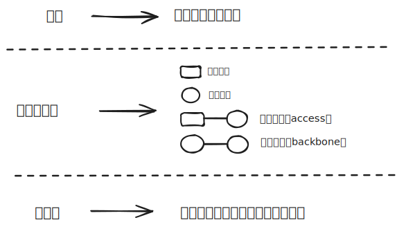
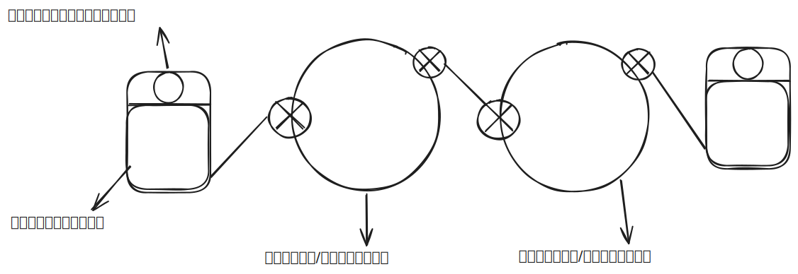

# 1.1 什么是Internet

下面这张图初步介绍了什么是计算机网络？

1. 网络：是由节点和边构成的系统
2. 计算机网络：是由主机节点和交换节点相互连接构成的系统
3. 互联网：是由一个个孤立的计算机网络相互连接构成的系统
::: details
交换节点有：交换机（链路层），路由器（网络层），网络负载均衡设备
:::

下面这张图一个大圈圈就是一个计算机网络，把这些单独的计算机网络连接起来，就形成了**互联网**

::: info
从这张图中得到，**互联网**是分布式的应用进程，以及为分布式应用进程提供通信服务的基础设施。
:::

**协议**：对等层实体在通讯过程中应该遵循的规则集合。

