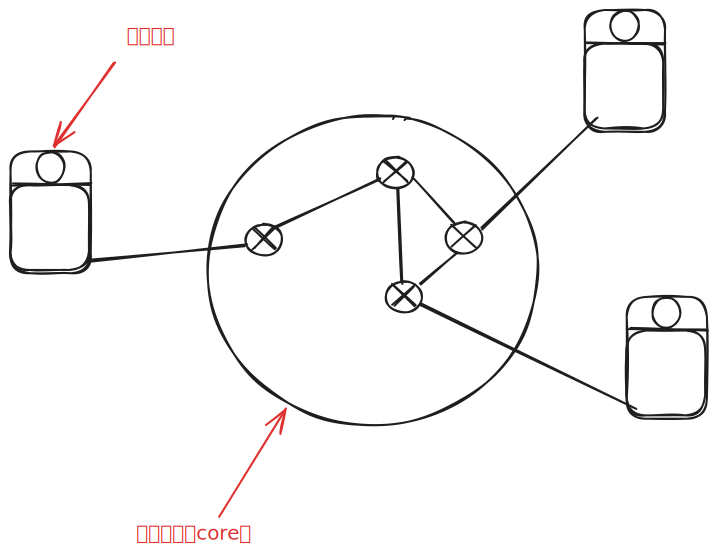

# 1.2 网络边缘

在上面一节中我们对互联网有了一个整体的认识，我们接下来将对分别从一下几个角度来认识网络

- 网络边缘
- 网络核心

这节我们先来说什么是网络边缘。

网络边缘又叫做：接入系统（access），边缘系统（edge）

接入网络的模式有两种：

1. **CS模式**（传统，即客户端服务器模式）
2. **P2P模式**（point to point）

::: details
**P2P** : 一个终端既可以当服务器也可以当客户端，代表有：迅雷... 
当我们在迅雷下载东西的时候，我们自己也可能正在当服务器给别人提供信息。
:::

## 专业名词

**面向连接服务**：在端系统之间传输数据

**握手**：在数据传输之前做好准备，两个通讯主机之间为连接建立状态

**TCP服务**：
- 可靠的，按顺序的传送数（确认和重传）
- 流量控制（发送方不会淹没接收方）
- 拥塞控制（当网络拥塞时候，发送方降低发送速率）

::: details
使用TCP的有：HTTP（web），FTP（文件传输），TeInet（远程登录），SMTP（email）
:::

**无连接服务**

- 无连接
- 不可靠数据传输
- 无流量控制
- 无拥塞控制

::: details
使用无连接服务的有，流媒体，远程会议，DNS，Internet电话。

为什么这些可以使用无连接服务呢？
:::

