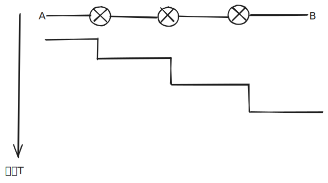
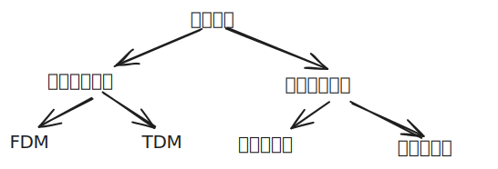

# 1.3 网络核心

## 老旧技术 （电路交换）

网络核心主要目的：将源目标主机发送的信息传送给目标主机。

在过去，我们有一种老旧的技术叫：**电路交换**来实现网络核心的功能。其工作原理类似于电视剧中出现的播电话，然后接线员将其接通。

那么一条线路只给一个人用，太过于浪费，于是有了:**频分**，**时分**，**波分** 

::: tip
将网络资源（如带宽）分成片的技术不同，叫频/时/波 分
:::

但电路交换还是有很大的缺点：

1. 建立连接时间长
2. 浪费的片较多
3. 可靠性不高

## 现代技术 （分组转发）

数据被拆成一段一段（分成一组一组），然后通过每一个交换节点就存储，然后转发。

这样的**好处**：存储转发，资源共享，按需要使用。

在某一个节点处：到达速率 > 链路的输出速率

- 分组将会排队，等待传输完
- 如果路由器的缓存用完了，分组将会被抛弃

::: danger
那为什么缓存不设置无线大呢？
:::

**关键功能**：

1. 路由：决定分组采用的源到目标的路径
2. 转发：将分组从路由器的输入链路转移到输出链路

::: tip
日常中使用网络，都是突发的，这里指的是我们浏览的时间比发送请求的时间长的多。

电路交换中：会一直占用一个链路，浪费的资源多；
分组交换中：来数据就分组转发，不会一直占用一条链路。

所以分组转发适合于网络的突发性。
:::

## 不同的寻路方式

我们按照网络层有没有连接分为

- 数据报方式：携带了目标主机的完整地址，不需要握手（路径不一样，可能会失序）
- 虚电路：需要先建立连接，虚电路号来标识

